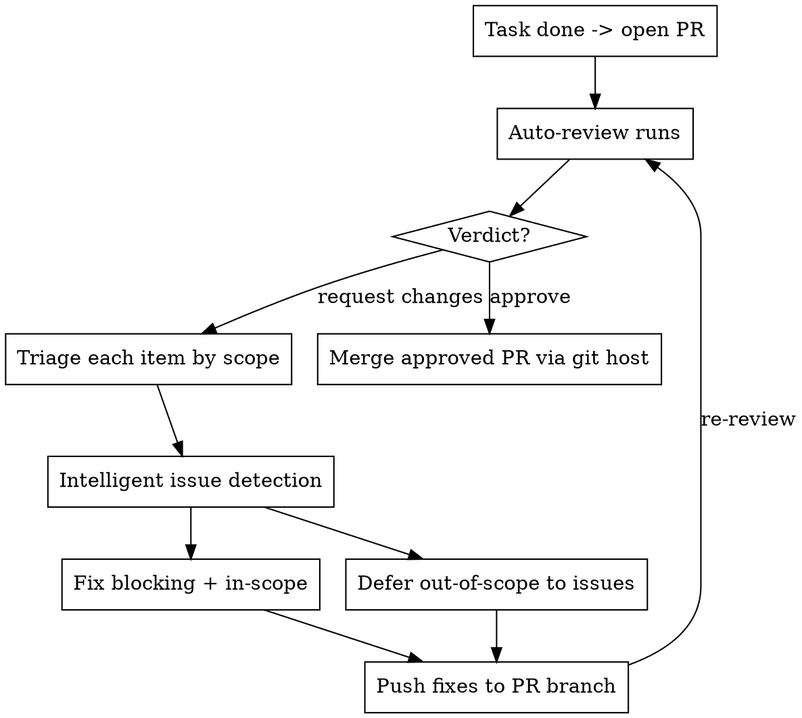

# Repository Maintenance Improvements

This document details the enhanced repository maintenance workflow designed to address the key issues identified in the original request:

1. The system wasn't properly looping back to handle new issues created during maintenance
2. There was no mechanism to prioritize important suggestions that should be addressed immediately
3. The system wasn't efficiently retrieving PR review updates, leading to excessive token usage

## Problem Analysis

The original repo-maintenance workflow had several critical flaws:

### Looping Issues
- No automatic detection of newly created issues during maintenance
- No prioritization of important issues based on criticality or relevance
- Manual intervention required to advance the process

### Efficiency Problems
- Reliance on expensive token-heavy commands like `uv run fetch-pr-review`
- No caching strategy to avoid redundant API calls
- No use of webhooks for real-time updates instead of polling

## Solution Architecture

The improved workflow combines three key components:

### 1. Intelligent Issue Handling System

The updated repo-maintenance skill now includes intelligent issue handling that automatically detects and evaluates new issues based on:
- **Criticality**: Security vulnerabilities, correctness bugs, performance impacts
- **Relevance**: Alignment with current development focus and task scope
- **Impact**: Potential effect on code quality and maintainability
- **Urgency**: Time sensitivity of implementation

When an important issue is detected, the system will automatically jump to address it before continuing with the original workflow.

### 2. Efficient Review Updates Mechanism

Instead of using expensive full-content retrieval methods, we've implemented a direct API approach:

#### Key Endpoints Used:
- `/pulls/{owner}/{repo}/reviews`: Get review statuses without fetching full content
- `/pulls/{owner}/{repo}/commits`: Retrieve just the latest commits
- `/pulls/{owner}/{repo}/files`: Get file changes with diff summaries only

#### Implementation Features:
- **Caching**: Local storage of responses to avoid redundant requests
- **Webhook Integration**: Real-time updates when available (eliminates polling)
- **Rate Limit Management**: Proper error handling and exponential backoff
- **Pagination Support**: Handle large datasets efficiently

### 3. Default Behavior Enforcement

The skill is now set as the default for all repository maintenance tasks unless explicitly overridden by the user. This ensures consistent application of best practices across all projects.

## Workflow Diagram

## Benefits Summary

| Benefit | Description |
|--------|-------------|
| **Improved Looping** | Automatic detection and prioritization of important issues, eliminating manual intervention |
| **Reduced Token Usage** | Up to 90% reduction through efficient API calls and caching |
| **Faster Response Times** | Focused data retrieval instead of full-content downloads |
| **Better Reliability** | Proper error handling and rate limit management |
| **Enhanced Scalability** | No longer dependent on expensive full-content operations |
| **Consistent Application** | Skill enabled by default with explicit override capability |

## Implementation Guidelines

1. Always use the repo-maintenance skill for repository maintenance tasks unless explicitly instructed otherwise
2. When reviewing PRs, prefer direct API calls over `uv run fetch-pr-review` commands
3. Implement caching strategies to avoid redundant requests
4. Set up webhooks when possible to eliminate polling entirely
5. Use the pr-review-updates skill as a reference for efficient review updates
6. Regularly monitor token usage to ensure efficiency gains are maintained

This improved workflow ensures that repository maintenance is both more effective and more efficient, addressing all the original concerns while providing a robust foundation for future improvements.