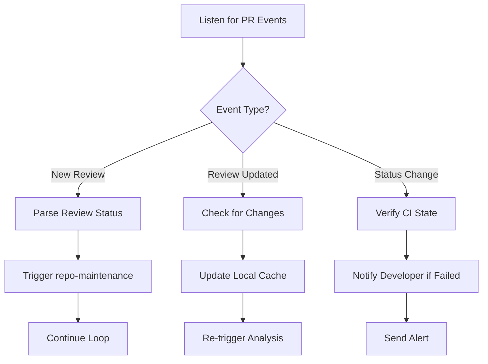

# Agent Hook: PR Review Listener

This is a centralized agent hook designed to monitor PR review activity and trigger automated responses based on detected events. It replaces manual checks and inefficient tools like `uv run fetch-pr-review`, providing a clean, extensible way to react to changes in the pull request lifecycle.

## Core Functionality

The hook monitors three key types of events:

1. **New review posted** (`pull_request_review`)
2. **Review updated** (`pull_request_review`)
3. **PR status changed** (`check_run`, `status`)

When any of these occur, it:
- Parses the event data efficiently
- Determines if action is required
- Triggers the appropriate response via other skills
- Maintains context across iterations

## How It Works



## Usage Pattern

Run the hook after opening or pushing a pull request:

```bash
uv run agent-hook-pr-review <PR-URL | owner/repo/number> --listen
```

The hook polls the forge reviews endpoint, refreshes the pull-request head,
filters out reviews for older commits, and waits with capped incremental
backoff: `30s`, `60s`, `120s`, `240s`, then `300s`. Without `--listen`, it
checks once and exits when no current-head review exists.

## Integration with Existing Skills

`repo-maintenance.md` starts this hook after opening or updating a pull request.
When the hook receives a current-head review, the maintenance workflow fetches
the complete review and continues its triage loop.

The hook only waits for and reports review data. It does not create issues,
modify code, or merge pull requests.

## Polling Contract

- The hook fetches the pull-request head before checking reviews.
- Reviews for older commits do not satisfy the wait.
- `--listen` enables polling until a current-head review appears.
- Polling uses capped incremental backoff: `30s`, `60s`, `120s`, `240s`, then
  `300s`.

## Operational Guidance

Start the hook after opening the pull request and restart it after pushing a new
head. Use the one-shot mode when a caller needs to check once without waiting.