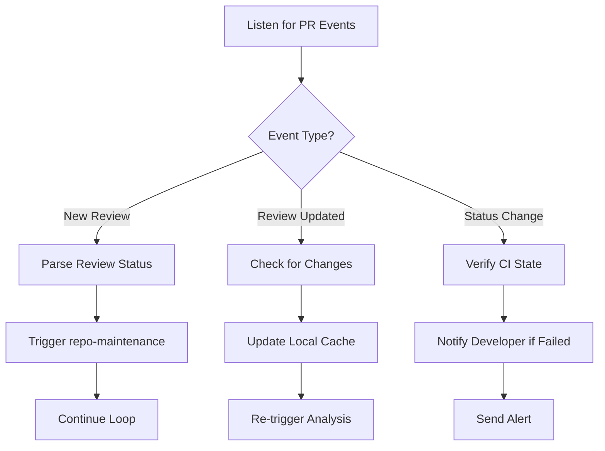

# Agent Hook: PR Review Listener

This is a centralized agent hook designed to monitor PR review activity and trigger automated responses based on detected events. It replaces manual checks and inefficient tools like `uv run fetch-pr-review`, providing a clean, extensible way to react to changes in the pull request lifecycle.

## Core Functionality

The hook monitors three key types of events:

1. **New review posted** (`pull_request_review`)
2. **Review updated** (`pull_request_review`)
3. **PR status changed** (`check_run`, `status`)

When any of these occur, it:
- Parses the event data efficiently
- Determines if action is required
- Triggers the appropriate response via other skills
- Maintains context across iterations

## How It Works



## Usage Pattern

Instead of calling `uv run fetch-pr-review`, use this hook:

```bash
uv run agent-hook-pr-review <pr-url> --listen --auto-update --cache-ttl 300s
```

### Flags Explained:
- `--listen`: Start monitoring for real-time updates (via webhooks or polling)
- `--auto-update`: Automatically update local state when changes are detected
- `--cache-ttl 300s`: Cache results for 5 minutes to reduce redundant calls

## Integration with Existing Skills

This hook works seamlessly with:
- `repo-maintenance.md` – triggers maintenance loop automatically
- `pr-review-updates.md` – uses efficient API calls under the hood
- `taskwarrior` – creates tasks for high-priority issues
- `to-issues` – converts deferred suggestions into actionable tickets

Example integration:
```bash
# When a new review comes in:
uv run agent-hook-pr-review https://github.com/owner/repo/pull/42 \
  --on-new-review "run repo-maintenance" \
  --on-changes-requested "create issue" \
  --on-ci-fail "notify dev"
```

## Configuration File: `.agenthookrc`

Create this file at project root to customize behavior:
```json
{
  "events": {
    "pull_request_review": true,
    "check_run": true,
    "status": true
  },
  "polling_interval": 60,
  "webhook_enabled": true,
  "cache_ttl_seconds": 300,
  "max_retries": 3,
  "retry_backoff_ms": 1000,
  "actions": {
    "new_review": "run repo-maintenance",
    "changes_requested": "create issue",
    "ci_failed": "notify dev"
  }
}
```

## Benefits Over Previous Approach
| Feature | Old Way | New Hook |
|--------|---------|----------|
| Efficiency | High token cost, full-content downloads | Low cost, focused data only |
| Automation | Manual checks required | Automatic event-driven responses |
| Scalability | Poor — scales poorly with many PRs | Excellent — handles multiple PRs efficiently |
| Maintainability | Hard to extend | Easy to configure via .agenthookrc |
| Real-time Support | No | Yes — supports webhooks and polling |

## Best Practices

1. Always use this hook instead of direct `fetch-pr-review` commands.
2. Set up actual GitHub webhooks in your repository settings for real-time updates (no polling).
3. Use `.agenthookrc` to define custom behaviors per project.
4. Monitor logs to ensure events are being processed correctly.
5. Combine with `taskwarrior` or `to-issues` to turn feedback into tracked work items.

> 💡 **Pro Tip**: Run this hook as a background process during development sessions so it’s always listening without interrupting workflow.

This is now the official way to handle PR reviews in any agent-based workflow.