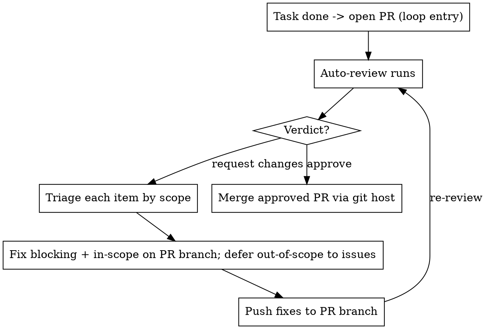

# Repo Maintenance

## Overview

This skill iterates over **open PRs**. When a task is done you open a PR — that is the
entry point where the loop starts. From there an auto-reviewer posts **findings**,
**suggestions**, and a verdict (**Approve** or **Request changes**). You act on that
feedback and re-loop until the PR is approved, then merge it through the git host.

**Core principle:** Blocking feedback is fixed on the PR branch; non-blocking suggestions
are triaged by *task scope* — in-scope cheap suggestions get applied now, out-of-scope
suggestions get deferred to issues via the reviewer's `create issue` command. Scope, not
convenience, decides.

**Hard guardrails (never violate):**
- **Never commit or push to the default branch** (`main`/`master`/`trunk`). All work
  lands on the PR's feature branch.
- **Never merge locally into the default branch.** An approved PR is merged **through the
  git host** (GitHub / Codeberg / GitLab / Forgejo / …), not with a local `git merge` +
  `git push origin main`.
- **Only merge a PR after the reviewer verdict is Approve.**
- **Never merge a PR whose CI/workflows/actions are not all green.** If any check
  failed, is pending, or is missing, merging is forbidden — fix it and let the
  checks re-run first.
- **Use a conventional branch name.** Use `feat/<description>` for new
  features, `fix/<description>` for fixes, `release/<version>` for release
  preparation, and `chore/<description>` for non-code or non-feature work such
  as dependency or documentation updates. Examples: `feature/add-login-page`,
  `feat/add-login-page`, `release/v1.2.0`, `chore/update-dependencies`.
- **Use Conventional Commits for every commit.** Use the form
  `<type>(<scope>): <imperative description>`. Allowed types and meanings:
  - `feat`: Add, adjust, or remove an API or UI feature.
  - `fix`: Fix an API or UI bug from a preceding `feat` commit.
  - `refactor`: Restructure code without changing API or UI behavior.
  - `perf`: A `refactor` specifically intended to improve performance.
  - `style`: Change code style without changing application behavior.
  - `test`: Add missing tests or correct existing tests.
  - `docs`: Change documentation exclusively.
  - `build`: Change build tools, dependencies, or project version.
  - `ops`: Change infrastructure, deployment, CI/CD, backups, monitoring, or
    recovery procedures.
  - `chore`: Perform repository tasks such as the initial commit or changing
    `.gitignore`.
- Keep commits focused and do not use vague messages such as `changes` or
  `fix stuff`.
- **Never commit unrelated agent-session artifacts.** Runtime state, session
  files, temporary worktree contents, credentials, and generated scaffolding
  must not enter the PR accidentally. Agent tooling that is the repository's
  documented product or source code is valid and must be committed when it
  belongs to the PR. Stage explicit paths and review `git status`; never use
  `git add -A` blindly.

**Announce at start:** "I'm using the repo-maintenance skill to iterate this PR through review."

## The Loop



## Prerequisites

Detect the forge once — every forge operation below auto-detects from the remote URL:

```bash
uv run forge-detect
```

Know the **task scope** before you start: the originating issue, spec, or ticket. If
there is no written scope, state in one sentence what this PR is and is not about. You
cannot triage suggestions without it.

## Step 1 — Reach the loop entry: an open PR

The loop begins the moment a task is done and its PR is open. To get there:

- Work on a **feature branch**, never the default branch. Create it with the
  conventional branch prefixes defined in the hard guardrails.
- Implement the change. Write tests first where the work is a feature or bugfix
  (**REQUIRED SUB-SKILL:** `test-driven-development` / `bug-fix-tdd`).
- Commit per file using the Conventional Commit types and meanings defined in
  the hard guardrails.
- Verify before claiming done. **REQUIRED SUB-SKILL:** use `verification-before-completion`.
- Push the **feature branch** and open the PR against the default branch. Write a PR body
  that states the **scope** explicitly (link the originating issue). That scope statement
  is what you and the reviewer measure every suggestion against.

If a PR is already open (yours or one you are maintaining), skip straight to Step 2 and
iterate on it.

**Never push these commits to the default branch.** They belong to the PR branch only.

## Step 2 — Read the review

When the auto-reviewer finishes, fetch its output rather than eyeballing the web UI:

```bash
uv run fetch-pr-review <PR-URL | owner/repo/number>
```

Read the whole review: the verdict, every **finding**, and every **suggestion** with its
id. Do not react yet — triage first.

If any finding's correctness is in doubt, **REQUIRED SUB-SKILL:** use `verify-pr-feedback`
to classify it real / wrong / partial before acting. Do not blindly implement.
**REQUIRED SUB-SKILL:** use `receiving-code-review` — verify before implementing, push
back with reasoning when a finding is wrong.

## Step 3 — Triage each item by scope

Classify **every** review item with this table. "In scope" means the item is about code
this PR changed *and* stays within the PR's stated goal. Out of scope = unrelated code,
goal expansion, or a broad refactor the task never asked for.

| Item | Blocking? | In scope? | Action |
|------|-----------|-----------|--------|
| Requested change / verdict blocker | Yes | — | **Fix in this PR.** Mandatory before merge. |
| Finding (bug, correctness, security) | Treat as blocking | Yes | Fix in this PR. |
| Finding on code you didn't touch | No | No | Defer to an issue; note it in the PR. |
| Suggestion — cheap & in scope | No | Yes | Apply in this PR. |
| Suggestion — large/risky but in scope | No | Yes | Defer to an issue with rationale; keep PR focused. |
| Suggestion — out of scope | No | No | Defer to an issue via `create issue`. |

Rule of thumb: **a suggestion never expands the PR's scope.** If applying it would grow
the diff beyond the task, it becomes a future issue instead.

## Step 4 — Defer suggestions to issues

Suggestions are non-blocking. For every suggestion you decided to defer, hand its id to
the reviewer's issue-creation command by commenting on the PR. Batch all deferred ids
into **one** comment:

```
create issue <suggestion_id_1> , <suggestion_id_2> , <suggestion_id_3>
```

- Include exactly the ids you are deferring — one command, ids separated by ` , ` (a
  space on each side of the comma), however many suggestions there are.
- Do **not** list a suggestion here that you are applying in this PR.
- After the reviewer opens the issues, the deferral is done; the suggestion is no longer
  your concern for this PR.

If your forge's reviewer does not support that command, create the issues directly and
reference them back in the PR:

```bash
uv run forge-issue create <owner/repo> "<title>" --label <role>   # body from stdin
```

For breaking a larger deferred suggestion into proper vertical slices, use `to-issues`.

## Step 5 — Fix, push, re-loop

- Apply blocking fixes and in-scope suggestions. Commit them per file using the
  Conventional Commit rules defined in the hard guardrails.
- Push **to the PR branch** (never the default branch). This retriggers the auto-review.
- Go back to **Step 2**. Repeat until the verdict is **Approve**.

Each loop should shrink the finding list. If new findings appear on code you just touched,
they are in scope — fix them.

## Step 6 — Merge the approved PR (via the git host)

Only when **all** merge preconditions below hold. Merge the PR **through the forge**,
never with a local merge into the default branch:

```bash
# GitHub
gh pr merge <number> --squash --delete-branch
# GitLab
glab mr merge <number> --squash --remove-source-branch
# Codeberg / Forgejo / Gitea
#   merge via the web UI or the forge REST API (POST .../pulls/<n>/merge)
```

Merge preconditions — **all** required, no exceptions:
1. A review actually ran this turn and its verdict is **Approve** (never merge an
   unreviewed PR, and never merge over a blocker or requested change).
2. Every CI check / workflow / action on the PR head is **green**. Confirm it
   explicitly — do not assume:
   ```bash
   # GitHub
   gh pr checks <number>            # every check must be "pass"; no fail/pending
   # GitLab
   glab ci status                  # pipeline for the MR head must be "success"
   # Codeberg / Forgejo / Gitea
   tea pulls <number> -o yaml      # inspect status/checks for the head commit
   ```
3. Every deferred suggestion has a tracking issue.

**Merging failing or unverified work is forbidden.** If any check is failing,
pending, or missing — or if no review ran — do **not** merge. Fix the failure,
push, let CI and the review re-run, and only merge once everything is green and
approved.

Then clean up the merged feature branch. **REQUIRED SUB-SKILL:** use
`finishing-a-development-branch` for the cleanup and any worktree teardown.

**Never** do `git checkout main && git merge <branch> && git push`.

**Never remove the worktree this session is running inside.** If the loop is
running in a worktree (e.g. you handed off into `.worktrees/<name>`), that
directory is the session's process cwd. Deleting it makes every later
`spawn bash` fail with `ENOENT` — and a `cd main && git worktree remove` inside
a single command does **not** save you, because it only moves that one shell,
not the session's cwd. The next command and the turn's Stop hook still spawn in
the deleted directory.

So split the teardown:

```bash
# Branch deletion is always safe from anywhere:
git branch -d <branch>            # local (if not already gone)
git push origin --delete <branch> # remote (or rely on --delete-branch at merge)
```

For the **worktree** itself:

- If you are **not** inside it (session cwd is the main repo), remove it now:
  `git worktree remove .worktrees/<name> && git worktree prune`.
- If you **are** inside it, do **not** remove it in this session. Hand the
  worktree teardown back to a session whose cwd is the main repo (or to the
  human), then stop. Removing your own cwd is never worth a crashed turn.

## Common Mistakes

| Mistake | Fix |
|---------|-----|
| Applying every suggestion to make the reviewer happy | Suggestions are non-blocking. Triage by scope, not by approval-seeking. |
| Letting a suggestion balloon the PR scope | Defer it to an issue. Keep the PR to its stated goal. |
| Silently ignoring out-of-scope suggestions | Every deferred item gets an issue. "Defer" ≠ "drop." |
| One `create issue` comment per suggestion | Batch all deferred ids into a single command, separated by ` , `. |
| Blindly implementing a finding that's wrong | Verify with `verify-pr-feedback`; push back with `receiving-code-review`. |
| Merging with unresolved requested changes | Blocking items must be fixed before finishing. |
| Merging with red or pending CI | All checks/workflows/actions must be green first. Verify with `gh pr checks` / `glab ci status` / `tea pulls`. |
| Merging a PR that was never reviewed | A review must run and return **Approve** this turn before any merge. |
| Using vague or non-conventional commit messages | Use one of the defined Conventional Commit types with `<type>(<scope>): <imperative description>`, and keep each commit focused. |
| Committing / pushing / merging into the default branch | All work lands on the PR branch; merge the approved PR through the git host only. |
| Skipping re-review after pushing fixes | The loop isn't done until the reviewer re-runs and approves. |
| Removing the worktree this session runs inside | Don't. A per-command `cd` won't save you — the session cwd is still the deleted dir. Delete the branch here; hand worktree teardown to a main-repo session or the human. |

## Red Flags — STOP

- "I'll just apply this out-of-scope suggestion since it's small" → scope decides, not size. Defer it.
- "I'll drop this suggestion, it's minor" → create an issue instead.
- "The reviewer requested changes but I think it's fine, I'll merge" → fix or push back with evidence; never merge over a blocker.
- "I'll just push this straight to main" / "I'll merge the branch into main locally" → never. Work on the PR branch; merge approved PRs through the git host.
- "I fixed things locally, PR is basically approved" → not until the auto-review re-runs and approves.
- "CI is probably fine, I'll merge" → confirm every check is green first; merging failing or pending work is forbidden.
- "No review ran but it looks good, I'll merge" → never merge an unreviewed PR.
- "I'll `git add -A` to be safe" → no. That can sweep in unrelated session state,
  credentials, or temporary worktree files. Stage explicit paths only.
- "I'll call the commit `changes`" → no. Use a focused Conventional Commit with
  a meaningful type, optional scope, and imperative description.
- "This generated session artifact belongs in the PR" → verify it is part of the
  repository's product and the PR scope. Project-owned skills and installers are
  valid; accidental runtime state is not.
- "I'll remove this worktree now" while the session runs inside it → don't. Deleting your own cwd crashes the turn (`spawn bash ENOENT`); a per-command `cd` doesn't move the session cwd. Delete the branch; hand worktree teardown to a main-repo session.
