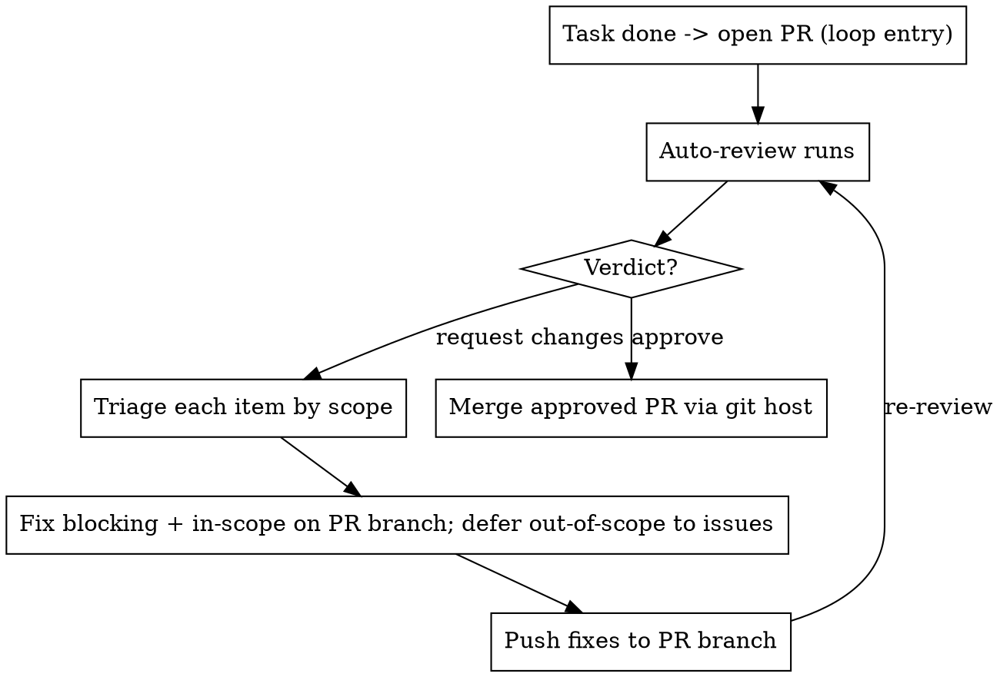

# Repo Maintenance

## Overview

This skill should be used for virtually all repository maintenance tasks unless explicitly instructed otherwise. It is an **autonomous** workflow: do not pause for user confirmation before routine branch creation, commits, pushes, opening a PR, or posting the review commands defined below. Continue the loop until the PR is approved and its merge and CI preconditions are satisfied.

When a task is complete, ensure there is an open PR. If none exists, create the feature branch, commit the work, push it, and open the PR against the default branch. From there an auto-reviewer posts **findings**, **suggestions**, and a verdict (**Approve** or **Request changes**). Read the complete review, reason about every item, act on the justified decisions, and re-loop until approved.

**Core principle:** Blocking feedback is fixed on the PR branch. Suggestions are not commands to change code: decide whether each is valuable, correct, repository-relevant, and within the explicit PR scope. Apply justified in-scope work, create issues for worthwhile deferred work, and dismiss only suggestions that genuinely do not make sense for this repository. Scope and engineering judgment—not convenience or approval-seeking—decide.

**Default behavior:** This skill is enabled by default for all repository maintenance tasks. It should only be bypassed when explicitly instructed by the user.

**Efficient Review Updates:** Use direct API calls rather than expensive token-heavy commands like `uv run fetch-pr-review`. Implement caching and use webhooks when available:
- Use GitHub's REST API `/pulls/{owner}/{repo}/reviews` endpoint to get review statuses without fetching full content
- Use `/pulls/{owner}/{repo}/commits` to get just the latest commits
- Use `/pulls/{owner}/{repo}/files` to get file changes without downloading entire files
- Implement local caching to avoid redundant requests
- Set up webhooks for real-time updates rather than polling
- Handle rate limits properly with exponential backoff

This approach reduces token usage significantly while still providing all necessary information for decision-making.

**Hard guardrails (never violate):**
- **Never commit or push to the default branch** (`main`/`master`/`trunk`). All work lands on the PR's feature branch.
- **Never merge locally into the default branch.** An approved PR is merged **through the git host** (GitHub / Codeberg / GitLab / Forgejo / …), not with a local `git merge` + `git push origin main`.
- **Only merge a PR after the reviewer verdict is Approve.**
- **Never merge a PR whose CI/workflows/actions are not all green.** If any check failed, is pending, or is missing, merging is forbidden — fix it and let the checks re-run first.
- **Never commit agent/tooling artifacts.** Skills and agent scaffolding ("superpowers", `.pi/`, `.claude/`, `.agents/`, `.worktrees/` internals, session placeholders, and `AGENTS.md`/`CLAUDE.md` you didn't author for this repo) are **never** committed. Only commit changes that belong to the PR's goal; `git add -A` blindly is forbidden — stage explicit paths and review `git status` first.

**Announce at start:** "I'm using the repo-maintenance skill to iterate this PR through review."

## The Loop



## Prerequisites

Select the forge CLI once from the current repository remote before any forge operation,
including post-merge status and rerun commands:

```bash
FORGE_CLI="$(uv run forge-detect --cli)"
```

The resolver selects `gh` for GitHub and `fj` for Forgejo-family or Codeberg hosts based
on the remote. Use `$FORGE_CLI` (or the corresponding supported command/API adapter)
for every merge, check, status, rerun, and API operation; do not assume a forge or
hard-code a CLI.

Know the **task scope** before you start: the originating issue, spec, or ticket. If
there is no written scope, state in one sentence what this PR is and is not about. You
cannot triage suggestions without it.

## Step 1 — Reach the loop entry: an open PR

The loop begins with an open PR. If no PR exists, perform these steps autonomously. Do not pause for user confirmation before routine maintenance actions:

- Work on a **feature branch**, never the default branch. Create it with the correct
  prefix. **REQUIRED SUB-SKILL:** use `conventional-branch`.
- Implement the change. Write tests first where the work is a feature or bugfix
  (**REQUIRED SUB-SKILL:** `test-driven-development` / `bug-fix-tdd`).
- Commit per file with Conventional Commits. **REQUIRED SUB-SKILL:** use `conventional-commit`.
- Verify before claiming done. **REQUIRED SUB-SKILL:** use `verification-before-completion`.
- Push the **feature branch** and open the PR against the default branch.

The PR description must be expressive enough to establish the decision boundary for review. Include:

1. **Motivation / context** and the originating issue, ticket, or request.
2. **Scope** — what this PR is changing and why it belongs together.
3. **Changes** — the meaningful implementation details.
4. **Validation** — tests, checks, and manual verification performed.
5. **Out of scope / follow-ups** — related work intentionally not included.
6. **Review notes** — risks, compatibility considerations, and focus areas.

Use the linked Codeberg PR style as a quality bar for a clear, narrative description:
`https://codeberg.org/gbrennon/ephact/pulls/234`.
The scope statement is the boundary used to evaluate every later suggestion.

If a PR is already open (yours or one you are maintaining), skip straight to Step 2 and
iterate on it.

**Never push these commits to the default branch.** They belong to the PR branch only.

## Step 2 — Read the review

When the auto-reviewer finishes, fetch its output rather than eyeballing the web UI:

```bash
uv run fetch-pr-review <PR-URL | owner/repo/number>
```

Read the whole review: the verdict, every **finding**, and every **suggestion** with its
id. Do not react yet — triage first.

If any finding's correctness is in doubt, **REQUIRED SUB-SKILL:** use `verify-pr-feedback`
to classify it real / wrong / partial before acting. Do not blindly implement.
**REQUIRED SUB-SKILL:** use `receiving-code-review` — verify before implementing, push
back with reasoning when a finding is wrong.

## Step 3 — Triage each item by scope

Classify **every** review item with this table. "In scope" means the item is about code
this PR changed *and* stays within the PR's stated goal. Out of scope = unrelated code,
goal expansion, or a broad refactor the task never asked for.

| Item | Blocking? | In scope? | Action |
|------|-----------|-----------|--------|
| Requested change / verdict blocker | Yes | — | **Fix in this PR.** Mandatory before merge. |
| Finding (bug, correctness, security) | Treat as blocking | Yes | Fix in this PR. |
| Finding on code you didn't touch | No | No | Defer to an issue; note it in the PR. |
| Suggestion — cheap & in scope | No | Yes | Apply in this PR. |
| Suggestion — large/risky but in scope | No | Yes | Defer to an issue with rationale; keep PR focused. |
| Suggestion — out of scope but valuable | No | No | Defer to an issue via `create issue`; explain why it is worthwhile and out of scope. |
| Suggestion — incorrect, harmful, duplicate, or irrelevant | No | No | Dismiss via `dismiss`; record a concise technical rationale. |

Before choosing an action, reason from the full review and repository context: inspect the
changed code, understand the suggestion's intended benefit, compare it with the PR scope,
and consider correctness, security, maintainability, duplication, and likely cost.

Rule of thumb: **a suggestion never expands the PR's scope.** If applying it would grow
the diff beyond the task, it becomes a future issue rather than an immediate change. Out
of scope does not by itself justify dismissal: valuable out-of-scope work gets an issue.

## Step 4 — Defer suggestions to issues

Suggestions are non-blocking. For every suggestion you decided to defer, hand its id to
the reviewer's issue-creation command by commenting on the PR. Batch all deferred ids
into **one** comment:

```
create issue <suggestion-id-prefix-1> , <suggestion-id-prefix-2>
```

The command accepts unique prefixes of suggestion IDs. Include only suggestions being
 deferred, and provide a short rationale in the surrounding comment when useful. **Do not create an issue for every suggestion**: create one only when the proposed work has real
 value to this repository but is outside this PR's scope or too large/risky to include.

For a suggestion that is wrong, harmful, duplicated, not applicable to this repository,
or otherwise genuinely nonsensical, comment:

```
dismiss <suggestion-id-prefix-1> , <suggestion-id-prefix-2>
```

`dismiss` also accepts unique ID prefixes. Give a concise reason for each dismissal. **Do not dismiss a suggestion merely because it is out of scope**; valuable out-of-scope work
 must use `create issue`. Resolve prefixes against the IDs in the review and never guess
 when a prefix is ambiguous.

If your forge's reviewer does not support that command, create the issues directly and
reference them back in the PR:

```bash
uv run forge-issue create <owner/repo> "<title>" --label <role>   # body from stdin
```

For breaking a larger deferred suggestion into proper vertical slices, use `to-issues`.

## Step 5 — Fix, push, re-loop

- Apply blocking fixes and in-scope suggestions. Commit them per file (`conventional-commit`).
- Push **to the PR branch** (never the default branch). This retriggers the auto-review.
- If CI/CD is configured, wait for all checks and workflows for the PR head to reach a
  terminal state before treating the iteration as complete. Pending work is not green;
  inspect failures and fix or rerun them according to the forge's rules.
- Go back to **Step 2**. Repeat until the verdict is **Approve** and required CI/CD is green.

Each loop should shrink the finding list. If new findings appear on code you just touched,
they are in scope — fix them.

## Step 6 — Merge the approved PR (via the git host)

Only when **all** merge preconditions below hold. Merge the PR **through the forge**,
never with a local merge into the default branch:

```bash
# Use the command/API adapter selected from the current repository remote.
$FORGE_CLI pr merge <number> --squash
```

For hosts whose supported merge API differs from the selected CLI, use the corresponding
`$FORGE_CLI`-selected API adapter rather than assuming GitHub or hard-coding another CLI.

### Post-merge workflow tracking

After merging, continue tracking the merged commit's CI/CD workflows until each reaches a
terminal state. Use the selected `$FORGE_CLI` (or its supported API adapter) to poll
workflow/check status for that merge commit. If a workflow fails, rerun that workflow
once with the selected CLI and resume tracking it. If it fails again, report the
persistent failure and stop retrying that workflow; do not silently ignore it. Record a
successful retry as the workflow's final outcome.

Merge preconditions — **all** required, no exceptions:
1. A review actually ran this turn and its verdict is **Approve** (never merge an
   unreviewed PR, and never merge over a blocker or requested change).
2. Every CI check / workflow / action on the PR head is **green**. Confirm it
   explicitly — do not assume:
   ```bash
   # GitHub
   gh pr checks <number>            # every check must be "pass"; no fail/pending
   # GitLab
   glab ci status                  # pipeline for the MR head must be "success"
   # Codeberg / Forgejo-compatible hosts
   $FORGE_CLI pulls <number> -o yaml      # inspect status/checks for the head commit
   ```
3. Every deferred suggestion has a tracking issue.

**Merging failing or unverified work is forbidden.** If any check is failing,
pending, or missing — or if no review ran — do **not** merge. Fix the failure,
push, let CI and the review re-run, and only merge once everything is green and
approved.

After the host-side merge succeeds, record the source worktree path and remove it
before deleting the branch. **REQUIRED SUB-SKILL:** use
`finishing-a-development-branch` for the cleanup and any worktree removal.

```bash
# Run from the main repository or another directory outside the source worktree.
git worktree remove <source-worktree-path>
git worktree prune
```

A maintenance process whose current cwd is the source worktree being removed must not
remove its own cwd. It must hand cleanup to the main-repository session (or the human),
report the handoff, and stop. Branch deletion is separate and happens only after the
worktree removal:

```bash
git branch -d <branch>            # local (if not already gone)
git push origin --delete <branch> # remote, after worktree cleanup
```

**Never** do `git checkout main && git merge <branch> && git push`.

## Common Mistakes

| Mistake | Fix |
|---------|-----|
| Applying every suggestion to make the reviewer happy | Suggestions are non-blocking. Triage by scope, not by approval-seeking. |
| Letting a suggestion balloon the PR scope | Defer it to an issue. Keep the PR to its stated goal. |
| Silently ignoring out-of-scope suggestions | Every deferred item gets an issue. "Defer" ≠ "drop." |
| One `create issue` comment per suggestion | Batch all deferred prefixes into a single command, separated by ` , `. |
| Dismissing all out-of-scope suggestions | Out of scope means issue when valuable, not automatic dismissal. |
| Treating pending CI/CD as success | Wait for configured checks and workflows to finish; fix failures before merging. |
| Asking permission before routine maintenance actions | This workflow is autonomous; act while honoring the hard safety guardrails. |
| Blindly implementing a finding that's wrong | Verify with `verify-pr-feedback`; push back with `receiving-code-review`. |
| Merging with unresolved requested changes | Blocking items must be fixed before finishing. |
| Merging with red or pending CI | All checks/workflows/actions must be green first. Verify with the selected `$FORGE_CLI` or its supported API adapter. |
| Merging a PR that was never reviewed | A review must run and return **Approve** this turn before any merge. |
| Committing / pushing / merging into the default branch | All work lands on the PR branch; merge the approved PR through the git host only. |
| Skipping re-review after pushing fixes | The loop isn't done until the reviewer re-runs and approves. |
| Removing the worktree this session runs inside | Don't. A per-command `cd` won't save you — the session cwd is still the deleted dir. Delete the branch here; hand worktree cleanup to a main-repo session or the human. |

## Red Flags — STOP

- "I'll just apply this out-of-scope suggestion since it's small" → scope decides, not size. Defer it.
- "I'll drop this suggestion, it's minor" → create an issue rather than dropping it.
- "The reviewer requested changes but I think it's fine, I'll merge" → fix or push back with evidence; never merge over a blocker.
- "I'll just push this straight to main" / "I'll merge the branch into main locally" → never. Work on the PR branch; merge approved PRs through the git host.
- "I fixed things locally, PR is basically approved" → not until the auto-review re-runs and approves.
- "CI is probably fine, I'll merge" → confirm every check is green first; merging failing or pending work is forbidden.
- "No review ran but it looks good, I'll merge" → never merge an unreviewed PR.
- "I'll `git add -A` to be safe" → no. That sweeps in superpowers/agent scaffolding. Stage explicit paths only.
- "This skill / `.pi` / `AGENTS.md` change is handy, I'll commit it too" → never. Agent tooling never lands in the maintained repo.
- "I'll remove this worktree now" while the session runs inside it → don't. Deleting your own cwd crashes the turn (`spawn bash ENOENT`); a per-command `cd` doesn't move the session cwd. Delete the branch; hand worktree cleanup to a main-repo session.
