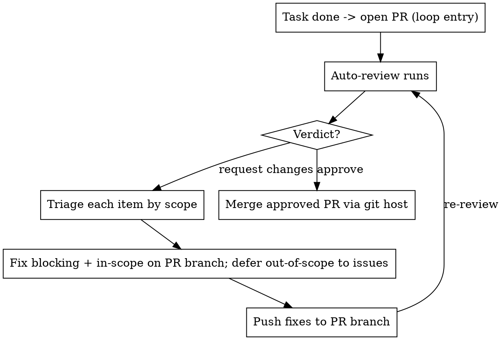

# Repo Maintenance

## Overview

This skill should be used for virtually all repository maintenance tasks unless explicitly instructed otherwise. It is an **autonomous** workflow: do not pause for user confirmation before routine branch creation, commits, pushes, opening a PR, or posting the review commands defined below. Continue the loop until the PR is approved and its merge and CI preconditions are satisfied.

When a task is complete, ensure there is an open PR. If none exists, create the feature branch, commit the work, push it, and open the PR against the default branch. From there an auto-reviewer posts **findings**, **suggestions**, and a verdict (**Approve** or **Request changes**). Read the complete review, reason about every item, act on the justified decisions, and re-loop until approved.

**Core principle:** Blocking feedback is fixed on the PR branch. Suggestions are not commands to change code: decide whether each is valuable, correct, repository-relevant, and within the explicit PR scope. Apply justified in-scope work, create issues for worthwhile deferred work, and dismiss only suggestions that genuinely do not make sense for this repository. Scope and engineering judgment—not convenience or approval-seeking—decide.

**Default behavior:** This skill is enabled by default for all repository maintenance tasks. It should only be bypassed when explicitly instructed by the user.

**Efficient Review Updates:** Use direct API calls rather than expensive token-heavy commands like `uv run fetch-pr-review`. Implement caching and use webhooks when available:
- Use GitHub's REST API `/pulls/{owner}/{repo}/reviews` endpoint to get review statuses without fetching full content
- Use `/pulls/{owner}/{repo}/commits` to get just the latest commits
- Use `/pulls/{owner}/{repo}/files` to get file changes without downloading entire files
- Implement local caching to avoid redundant requests
- Set up webhooks for real-time updates rather than polling
- Handle rate limits properly with exponential backoff

This approach reduces token usage significantly while still providing all necessary information for decision-making.

**Hard guardrails (never violate):**
- **Never commit or push to the default branch** (`main`/`master`/`trunk`). All work lands on the PR's feature branch.
- **Never merge locally into the default branch.** An approved PR is merged **through the git host** (GitHub / Codeberg / GitLab / Forgejo / …), not with a local `git merge` + `git push origin main`.
- **Only merge a PR after the reviewer verdict is Approve.**
- **Use a conventional branch name.** Use `feat/<description>` for new
  features, `fix/<description>` for fixes, `release/<version>` for release
  preparation, and `chore/<description>` for non-code or non-feature work such
  as dependency or documentation updates. Examples: `feature/add-login-page`,
  `feat/add-login-page`, `release/v1.2.0`, `chore/update-dependencies`.
- **Use Conventional Commits for every commit, without exception.** This
  includes code, API/UI changes, docs, tests, configuration, dependencies,
  build files, operations, and miscellaneous repository work. Use the form
  `<type>(<scope>): <imperative description>`. Allowed types and meanings:
  - `feat`: Add, adjust, or remove an API or UI feature.
  - `fix`: Fix an API or UI bug from a preceding `feat` commit.
  - `refactor`: Restructure code without changing API or UI behavior.
  - `perf`: A `refactor` specifically intended to improve performance.
  - `style`: Change code style without changing application behavior.
  - `test`: Add missing tests or correct existing tests.
  - `docs`: Change documentation exclusively.
  - `build`: Change build tools, dependencies, or project version.
  - `ops`: Change infrastructure, deployment, CI/CD, backups, monitoring, or
    recovery procedures.
  - `chore`: Perform repository tasks such as the initial commit or changing
    `.gitignore`; use it for other work that does not fit a more specific type.
- Every change must fit one of these types. Keep commits focused and do not use
  vague messages such as `changes` or `fix stuff`.
- **Never commit unrelated agent-session artifacts.** Runtime state, session
  files, temporary worktree contents, credentials, and generated scaffolding
  must not enter the PR accidentally. Agent tooling that is the repository's
  documented product or source code is valid and must be committed when it
  belongs to the PR. Stage explicit paths and review `git status`; never use
  `git add -A` blindly.
- **Never merge a PR whose CI/workflows/actions are not all green.** If any check
  failed, is pending, or is missing, merging is forbidden — fix it and let the
  checks re-run first.
- **Never ignore a finding on a modified file.** If a hook, test, linter,
  formatter, type checker, static analyzer, or other quality tool flags a file
  changed by the PR, investigate and resolve it before finishing. Do not hide,
  suppress, skip, or dismiss the finding without evidence and an explicit scope
  decision.

**Announce at start:** "I'm using the repo-maintenance skill to iterate this PR through review."

## The Loop



## Prerequisites

Select the forge CLI once from the current repository remote before any forge operation,
including post-merge status and rerun commands:

```bash
if command -v forge-detect >/dev/null 2>&1; then
  FORGE_CLI="$(forge-detect --cli)"
else
  REMOTE_NAME="${REMOTE:-$(git config --get "branch.$(git branch --show-current).remote" 2>/dev/null || git remote | { IFS= read -r first; printf '%s' "$first"; })}"
  REMOTE_URL="$(git remote get-url "$REMOTE_NAME")"
  case "$REMOTE_URL" in
    *github.com*) FORGE_CLI=gh ;;
    *codeberg.org*|*forgejo*|*gitea*) FORGE_CLI=fj ;;
    *)
      printf 'Cannot select a forge CLI for remote: %s\n' "$REMOTE_URL" >&2
      exit 1
      ;;
  esac
fi

command -v "$FORGE_CLI" >/dev/null 2>&1 || {
  printf '%s is required for this repository remote\n' "$FORGE_CLI" >&2
  exit 1
}
```

Use the installed resolver when available. Do **not** run `uv run forge-detect` in a
different repository: `uv run` resolves commands from that repository's environment and
may not contain this project. The fallback selects `gh` for GitHub and `fj` for
Forgejo-family or Codeberg hosts directly from the configured git remote, then verifies
that the selected executable exists.

Before any operation, inspect the selected CLI's installed command surface:

```bash
"$FORGE_CLI" --help
"$FORGE_CLI" pr --help
```

Use only subcommands and flags shown by that help output, or use the selected forge's API
adapter. Never substitute a command from another forge or assume that every CLI version
supports a particular command or flag.

The resolver selects `gh` for GitHub and `fj` for Forgejo-family or Codeberg hosts based
on the remote. Use `$FORGE_CLI` (or the corresponding supported API adapter) for every
merge, check, status, rerun, and API operation; do not assume a forge or hard-code a CLI.

Know the **task scope** before you start: the originating issue, spec, or ticket. If
there is no written scope, state in one sentence what this PR is and is not about. You
cannot triage suggestions without it.

Work can enter the loop from a **tracker item** (issue, ticket, or task) as well as
from a direct request. When picking up tracker work, read the item's full body and
comment thread first — the acceptance criteria and discussion are the scope. A
vague item is handled autonomously, not by pausing: brainstorm the possible
readings, record the ambiguity and your chosen interpretation in the PR
description, infer the most bounded reading from the code and discussion
context, and proceed when that reading is safe to ship. Only stop when every
reading materially changes the work and the choice cannot be made safely —
then report the blocker on the tracker item rather than waiting silently.
Reference the item number in the PR description and close it via the
forge (e.g. `Fixes #N`) so the tracker stays authoritative. `create issue` output
from reviewer commands feeds this same entry: a freshly created issue is a new
loop entry, not a dead end.

## Step 1 — Reach the loop entry: an open PR

The loop begins with an open PR. If no PR exists, perform these steps autonomously. Do not pause for user confirmation before routine maintenance actions:

- Work on a **feature branch**, never the default branch. Create it with the
  conventional branch prefixes defined in the hard guardrails.
- **Size the work before coding.** If the task is more than a trivial fix:
  - **Brainstorm the intent first.** **REQUIRED SUB-SKILL:** `brainstorming` —
    explore requirements and alternatives before committing to an approach;
    for refactors, confirm the target design against the current code before
    planning.
  - **Design before implementing a refactor.** For anything restructuring
    modules, contracts, or layers, **REQUIRED SUB-SKILL:** use
    `codebase-design` / `request-refactor-plan` to produce the target design
    and an incremental, independently-verifiable commit sequence — then
    implement that plan. A refactor without a written plan drifts.
- Implement the change. Write tests first where the work is a feature or bugfix
  (**REQUIRED SUB-SKILL:** `test-driven-development` / `bug-fix-tdd`).
- Verify before claiming done. **REQUIRED SUB-SKILL:** use `verification-before-completion`.
- **Confirm the worktree and branch are in sync with the default branch before pushing or
  opening the PR.** The working tree must be clean, and the PR branch must contain the
  latest default-branch commits:
  ```bash
  git status --porcelain            # MUST be empty before synchronization
  git fetch origin
  DEFAULT_BRANCH="$(git symbolic-ref --short refs/remotes/origin/HEAD 2>/dev/null || printf 'origin/main')"
  git merge-base --is-ancestor "$DEFAULT_BRANCH" HEAD || git rebase "$DEFAULT_BRANCH"
  git status --porcelain            # MUST still be empty after rebase
  git log --oneline "$DEFAULT_BRANCH"..HEAD   # sanity: only this PR's commits
  git branch --show-current
  git worktree list
  ```
  If the rebase produces conflicts, resolve them, re-run the relevant tests, and repeat
  this gate. Confirm that `git branch --show-current` is the PR branch and `git worktree
  list` shows this worktree checked out on that branch; never push from a detached or wrong
  worktree. Do not open the PR until all checks above pass.

- **Push the feature branch** and open the PR against the default branch.

The PR description must be expressive enough to establish the decision boundary for review. Include:

1. **Motivation / context** and the originating issue, ticket, or request.
2. **Scope** — what this PR is changing and why it belongs together.
3. **Changes** — the meaningful implementation details.
4. **Validation** — tests, checks, and manual verification performed.
5. **Out of scope / follow-ups** — related work intentionally not included.
6. **Review notes** — risks, compatibility considerations, and focus areas.

Use the linked Codeberg PR style as a quality bar for a clear, narrative description:
`https://codeberg.org/gbrennon/ephact/pulls/234`.
The scope statement is the boundary used to evaluate every later suggestion.

If a PR is already open (yours or one you are maintaining), skip straight to Step 2 and
iterate on it.

**Never push these commits to the default branch.** They belong to the PR branch only.

## Step 2 — Read the review

When the auto-reviewer finishes, fetch its output rather than eyeballing the web UI:

```bash
uv run fetch-pr-review <PR-URL | owner/repo/number>
```

If `fetch-pr-review` is not available in the repo, read the forge's **reviews
endpoint** directly (`/repos/{owner}/{repo}/pulls/{number}/reviews`). The
verdict and every suggestion live there — PR comments are a different resource,
and a PR view reporting "0 comments" says nothing about reviews: an APPROVED
review with suggestions coexists with zero comments.

Read the whole review: the verdict, every **finding**, and every **suggestion**
with its id. **An Approve verdict does not mean "no suggestions"** — triage
them like any other. Do not react yet — triage first.

The reviewer (pr-auto-reviewer) **polls** for open PRs and new pushes, so a
review typically appears within roughly 2–3 minutes — but the delay is
unbounded when it is mid-loop on another review, and it never posts PR
comments. Poll the reviews endpoint on a cadence (e.g. every 30–60 s) for at
least 10 minutes before drawing any conclusion. One early probe finding no
review is not evidence the reviewer is unconfigured, and the reviews endpoint
answers everything you might otherwise ask the human.

If any finding's correctness is in doubt, **REQUIRED SUB-SKILL:** use `verify-pr-feedback`
to classify it real / wrong / partial before acting. Do not blindly implement.
**REQUIRED SUB-SKILL:** use `receiving-code-review` — verify before implementing, push
back with reasoning when a finding is wrong.

## Step 3 — Triage each item by scope

Classify **every** review item with this table. "In scope" means the item is about code
this PR changed *and* stays within the PR's stated goal. Out of scope = unrelated code,
goal expansion, or a broad refactor the task never asked for.

| Item | Blocking? | In scope? | Action |
|------|-----------|-----------|--------|
| Requested change / verdict blocker | Yes | — | **Fix in this PR.** Mandatory before merge. |
| Finding (bug, correctness, security) | Treat as blocking | Yes | Fix in this PR. |
| Finding on code you didn't touch | No | No | Defer to an issue; note it in the PR. |
| Suggestion — cheap & in scope | No | Yes | Apply in this PR. |
| Suggestion — large/risky but in scope | No | Yes | Defer to an issue with rationale; keep PR focused. |
| Suggestion — out of scope but valuable | No | No | Defer to an issue via `create issue`; explain why it is worthwhile and out of scope. |
| Suggestion — incorrect, harmful, duplicate, or irrelevant | No | No | Dismiss via `dismiss`; record a concise technical rationale. |

Before choosing an action, reason from the full review and repository context: inspect the
changed code, understand the suggestion's intended benefit, compare it with the PR scope,
and consider correctness, security, maintainability, duplication, and likely cost.

Rule of thumb: **a suggestion never expands the PR's scope.** If applying it would grow
the diff beyond the task, it becomes a future issue rather than an immediate change. Out
of scope does not by itself justify dismissal: valuable out-of-scope work gets an issue.

## Step 4 — Defer suggestions to issues

Suggestions are non-blocking. For every suggestion you decided to defer, hand its id to
the reviewer's issue-creation command by commenting on the PR. Batch all deferred ids
into **one** comment:

```
create issue <suggestion-id-prefix-1> , <suggestion-id-prefix-2>
```

The command accepts unique prefixes of suggestion IDs. Include only suggestions being
 deferred, and provide a short rationale in the surrounding comment when useful. **Do not create an issue for every suggestion**: create one only when the proposed work has real
 value to this repository but is outside this PR's scope or too large/risky to include.

For a suggestion that is wrong, harmful, duplicated, not applicable to this repository,
or otherwise genuinely nonsensical, comment:

```
dismiss <suggestion-id-prefix-1> , <suggestion-id-prefix-2>
```

`dismiss` also accepts unique ID prefixes. Give a concise reason for each dismissal. **Do not dismiss a suggestion merely because it is out of scope**; valuable out-of-scope work
 must use `create issue`. Resolve prefixes against the IDs in the review and never guess
 when a prefix is ambiguous.

If your forge's reviewer does not support that command, create the issues directly and
reference them back in the PR:

```bash
uv run forge-issue create <owner/repo> "<title>" --label <role>   # body from stdin
```

The reviewer processes these commands asynchronously through the same polling
loop — typically a few minutes (observed ~2–3), longer when it is mid-loop on
another review. After posting, verify the outcome before declaring the loop
done: re-check the issues list and the PR comments until the `create issue`
command has produced its tracking issue (record its number) and the `dismiss`
is reflected. Poll on a cadence and allow at least 15 minutes; if still
nothing, fall back to creating the issue directly (below) so no deferred
suggestion is left untracked — and say so in the PR comment so a later bot
action doesn't duplicate it.


For breaking a larger deferred suggestion into proper vertical slices, use `to-issues`.

## Step 5 — Fix, push, re-loop

- Apply blocking fixes and in-scope suggestions. Commit them per file using the
  Conventional Commit rules defined in the hard guardrails.
- Push **to the PR branch** (never the default branch). This retriggers the auto-review.
- If CI/CD is configured, wait for all checks and workflows for the PR head to reach a
  terminal state before treating the iteration as complete. Pending work is not green;
  inspect failures and fix or rerun them according to the forge's rules.
- Go back to **Step 2**. Repeat until the verdict is **Approve** and required CI/CD is green.

Each loop should shrink the finding list. If new findings appear on code you just touched,
they are in scope — fix them.

## Step 6 — Merge the approved PR (via the git host)

Only when **all** merge preconditions below hold. Merge the PR **through the forge**,
never with a local merge into the default branch:

Before merging, inspect the selected CLI's supported pull-request commands:

```bash
"$FORGE_CLI" --help
"$FORGE_CLI" pr --help
```

Use whichever merge subcommand and branch-deletion flag those help outputs document, or
use the selected forge's API adapter. Do not copy a merge command or branch-deletion flag
from another forge or assume it is portable across CLI versions.

### Post-merge workflow tracking

After merging, continue tracking the merged commit's CI/CD workflows until each
reaches a terminal state. Use the selected `$FORGE_CLI` (or its supported API
adapter) to poll workflow/check status for that merge commit. If an initial
workflow attempt fails, the model MUST perform at least two additional rerun
attempts for that same workflow and MUST wait for each attempt to reach a
terminal state before evaluating it. If either required rerun succeeds, record
that workflow's final outcome as successful and continue tracking all other
workflows. If the initial attempt and both additional reruns fail, the model MUST
inspect the available workflow status, logs, and failure details, investigate and
record the likely reason, and create a follow-up tracker task/issue whose next
task is to implement the fix. Persistent post-merge failure keeps the pipeline
unhealthy: do not declare the maintenance loop complete, do not claim all
workflows are green, and do not silently ignore the failure. Continue tracking
independent workflows to terminal states.

Merge preconditions — **all** required, no exceptions:
1. A review actually ran this turn and its verdict is **Approve** (never merge an
   unreviewed PR, and never merge over a blocker or requested change). An
   approved review counts only after you have fetched it and verified it is
   fresh — it reviews the current head commit.
2. **Every suggestion in the review is triaged before merging.** Verdict
   Approve + untriaged suggestions means the loop is not finished: apply the
   in-scope ones, post `create issue`/`dismiss` for the rest, and only then
   merge. Merging ahead of triage forces the reviewer commands onto a merged
   PR where they may not be processed.
3. Every CI check / workflow / action on the PR head is **green**. Confirm it
   explicitly — do not assume. First inspect the selected CLI's supported pull-request
   status commands:
   ```bash
   "$FORGE_CLI" --help
   "$FORGE_CLI" pr --help
   ```
   Use the status/check command documented by those help outputs, or the selected forge's
   API adapter. Treat unsupported subcommands and version-specific flags as a blocked
   operation, not as permission to substitute another forge CLI.
4. Every deferred suggestion has a tracking issue.

**Merging failing or unverified work is forbidden.** If any check is failing,
pending, or missing — or if no review ran — do **not** merge. Fix the failure,
push, let CI and the review re-run, and only merge once everything is green and
approved.

After the forge confirms the PR is merged, remove the merged feature branch's
worktree and clean up the branch. **REQUIRED SUB-SKILL:** use
`finishing-a-development-branch` for the cleanup and any worktree teardown.
The worktree must be removed after merge; if this session is inside it, hand
removal to a main-repo session or the human instead of deleting the session's
own cwd.

**Never** do `git checkout main && git merge <branch> && git push`.

**Never remove the worktree this session is running inside.** If the loop is
running in a worktree (e.g. you handed off into `.worktrees/<name>`), that
directory is the session's process cwd. Deleting it makes every later
`spawn bash` fail with `ENOENT` — and a `cd main && git worktree remove` inside
a single command does **not** save you, because it only moves that one shell,
not the session's cwd. The next command and the turn's Stop hook still spawn in
the deleted directory.

So split the teardown:

```bash
# Run from the main repository or another directory outside the source worktree.
git worktree remove <source-worktree-path>
git worktree prune
```

A maintenance process whose current cwd is the source worktree being removed must not
remove its own cwd. It must hand cleanup to the main-repository session (or the human),
report the handoff, and stop. Branch deletion is separate and happens only after the
worktree removal:

```bash
git branch -d <branch>            # local (if not already gone)
git push origin --delete <branch> # remote, after worktree cleanup
```

**Never** do `git checkout main && git merge <branch> && git push`.

## Common Mistakes

| Mistake | Fix |
|---------|-----|
| Applying every suggestion to make the reviewer happy | Suggestions are non-blocking. Triage by scope, not by approval-seeking. |
| Letting a suggestion balloon the PR scope | Defer it to an issue. Keep the PR to its stated goal. |
| Silently ignoring out-of-scope suggestions | Every deferred item gets an issue. "Defer" ≠ "drop." |
| One `create issue` comment per suggestion | Batch all deferred prefixes into a single command, separated by ` , `. |
| Dismissing all out-of-scope suggestions | Out of scope means issue when valuable, not automatic dismissal. |
| Treating pending CI/CD as success | Wait for configured checks and workflows to finish; fix failures before merging. |
| Rerunning a failed post-merge workflow only once or stopping after reporting it | Perform two additional reruns, wait for each to reach a terminal state, investigate logs/status after both fail, create a follow-up fix task, and keep the pipeline marked failed. |
| Asking permission before routine maintenance actions | This workflow is autonomous; act while honoring the hard safety guardrails. |
| Blindly implementing a finding that's wrong | Verify with `verify-pr-feedback`; push back with `receiving-code-review`. |
| Merging with unresolved requested changes | Blocking items must be fixed before finishing. |
| Merging with red or pending CI | All checks/workflows/actions must be green first. Verify with the selected `$FORGE_CLI` or its supported API adapter. |
| Ignoring a tool finding on a modified file | Investigate and resolve findings from hooks, tests, linters, formatters, type checkers, and analyzers before finishing. Never suppress or skip them silently. |
| Merging a PR that was never reviewed | A review must run and return **Approve** this turn before any merge. |
| Concluding "no reviewer configured" from one early probe | The reviewer polls open PRs; a review typically lands in ~2–3 min but can take longer when it is mid-loop elsewhere. Poll the reviews endpoint, not PR comments; "0 comments" ≠ no review. Never report a missing reviewer or ask the human what the reviews API answers. |
| Merging an Approve while suggestions are untriaged | Triage every suggestion first; merge only after in-scope fixes land and `create issue`/`dismiss` commands are posted. |
| Posting `create issue`/`dismiss` and walking away | The bot processes commands through its polling loop (typically minutes, unbounded mid-loop); verify the tracking issue exists (or fall back to creating it directly, noting the duplicate risk) before declaring the loop done. |
| Using vague or non-conventional commit messages | Classify every change, including miscellaneous work, with a defined type and use `<type>(<scope>): <imperative description>`. Use `chore` only when no more specific type fits. |
| Committing / pushing / merging into the default branch | All work lands on the PR branch; merge the approved PR through the git host only. |
| Skipping re-review after pushing fixes | The loop isn't done until the reviewer re-runs and approves. |
| Leaving a merged worktree behind | Remove it after the forge confirms the merge. If this session runs inside it, hand removal to a main-repo session or the human. |
| Removing the worktree this session runs inside | Don't. A per-command `cd` won't save you — the session cwd is still the deleted dir. Delete the branch here; hand worktree teardown to a main-repo session or the human. |

## Red Flags — STOP

- "I'll just apply this out-of-scope suggestion since it's small" → scope decides, not size. Defer it.
- "I'll drop this suggestion, it's minor" → create an issue rather than dropping it.
- "The reviewer requested changes but I think it's fine, I'll merge" → fix or push back with evidence; never merge over a blocker.
- "I'll just push this straight to main" / "I'll merge the branch into main locally" → never. Work on the PR branch; merge approved PRs through the git host.
- "I fixed things locally, PR is basically approved" → not until the auto-review re-runs and approves.
- "No review showed up in my first check, so no reviewer exists" → the reviewer polls open PRs: typically ~2–3 min, longer when mid-loop on another review. Poll the reviews endpoint on a cadence for at least 10 minutes; it never posts PR comments.
- "Verdict is Approve, so the review had nothing actionable" → an Approve can still carry suggestions; triage them all before merging.
- "No review ran but it looks good, I'll merge" → never merge an unreviewed PR.
- "That hook/lint/test finding is unrelated, I'll ignore it" → not on a modified file. Investigate and resolve it, or document an evidence-based scope decision before continuing.
- "I'll `git add -A` to be safe" → no. That can sweep in unrelated session state,
  credentials, or temporary worktree files. Stage explicit paths only.
- "This skill / `.pi` / `AGENTS.md` change is handy, I'll commit it too" → never.
  Agent tooling never lands in the maintained repo.
- "I'll call the commit `changes`" → no. Use a focused Conventional Commit with
  a meaningful type, optional scope, and imperative description.
- "This generated session artifact belongs in the PR" → verify it is part of the
  repository's product and the PR scope. Project-owned skills and installers are
  valid; accidental runtime state is not.
- "I'll remove this worktree now" while the session runs inside it → don't. Deleting your own cwd crashes the turn (`spawn bash ENOENT`); a per-command `cd` doesn't move the session cwd. Delete the branch; hand worktree teardown to a main-repo session.
